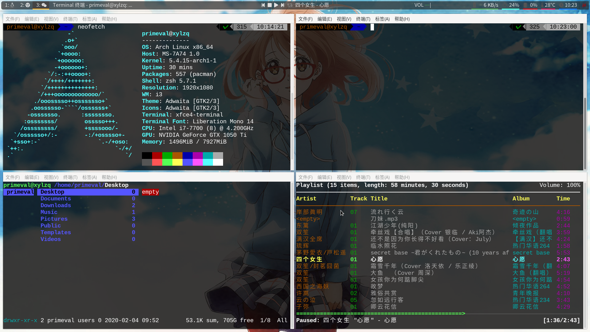

## 我的i3配置文件


### 截图




### 需要的软件

* *i3-gaps* : 窗口管理器
* *feh* : 设置背景图片
* *compton* : 终端透明
* *xfce4-terminal* : 终端
* *polybar* : 状态栏
* *i3lock-fancy-git* : 锁屏
* *mpd* : 音乐播放器守护程序
* *rofi* : 程序启动项


### 安装

#### 1.安装基础包
```
pacman -S xfce4-terminal feh compton i3-gaps mpd rofi base-devel yaourt
yaourt -S polybar-git i3lock-fancy-git
```
#### 2.安装字体图标
```
pacman -S adobe-source-han-sans-cn-fonts
pacman -S adobe-source-han-sans-tw-fonts
pacman -S adobe-source-han-sans-jp-fonts
pacman -S ttf-liberation
yaourt -S otf-font-awesome
yaourt -S ttf-material-icons-git 
```
#### 3.安装必要依赖
- mpd依赖（i3配置文件中调节音乐所需）
```
pacman -S ncmpcpp mpc
```
- alsaer依赖（i3配置文件中调节音量所需）
```
pacman -S pavucontrol alsa-utils pulseaudio pulseaudio-alsa
```
- polybar依赖
```
pacman -S cmake git wget python python2 pkg-config
pacman -S cairo xcb-util-image xcb-util-wm xcb-util-xrm xcb-util-cursor curl
yaourt -S alsa-lib libmpdclient wireless_tools jsoncpp i3ipc-glib-git ttf-unifont siji-git
```
#### 4.安装oh-my-zsh
- oh-my-zsh
```
sh -c "$(curl -fsSL https://raw.github.com/ohmyzsh/ohmyzsh/master/tools/install.sh)"
sh -c "$(wget https://raw.github.com/ohmyzsh/ohmyzsh/master/tools/install.sh -O -)"
sudo pacman -S oh-my-zsh-git
```
- oh-my-zsh 插件
```
cd ~/.oh-my-zsh/custom/plugins
git clone https://github.com/zsh-users/zsh-syntax-highlighting.git(高亮光标，修改插件配置时必须放最下面)
git clone https://github.com/zsh-users/zsh-autosuggestions（命令补全插件）
```
```
nano ~/.zshrc
plugins=(
  git
  zsh-autosuggestions
  zsh-syntax-highlighting
)
```
- oh-my-zsh 主题
```
sudo pacman -S zsh-theme-powerlevel9k

To enable Powerlevel9k theme for your user type:

echo 'source /usr/share/zsh-theme-powerlevel9k/powerlevel9k.zsh-theme' >> ~/.zshrc
```
- oh-my-zsh 字体
```
sudo pacman -S nerd-fonts-complete

将终端字体改为nerd-fonts，否则主题特殊符号无法显示
```
#### 5.安装实用软件
- 文件管理器
```
sudo pacman -S pcmanfm
```
- 主题管理器
```
sudo pacman -S lxappearance
所需依赖：
sudo pacman -S gnome-themes-standard
可选主题：
yaourt -S gtk-theme-arc-git
sudo pacman -S gtk-engine-murrine gtk-engines
```

### 注意事项

#### 1.polybar配置文件
- 查看自己的网卡设备，并将[module/eth] 或[module/wlan]下的interface设置为自己的网卡设备名字
```
ip link show
```
- 检查配置文件
可将配置文件中的[bar/mybar]改为[bar/example],再输入：
```
polybar example
```
- 查看配置文件模板是否加载成功，也可按需求开启或者关闭某些模板。

- 修改完成后，将[bar/example]改回[bar/mybar]

#### 2.mpd配置文件
- 重启后音乐模块图标并没有显示是因为mpd默认目录里没有文件可通过修改.config/mpd/mpd.conf文件来改变这个路径。
- 可通过命令行键入ncmpcpp或者$mod+ctrl+m进入音乐控制,按u刷新音乐数据库，接着按2浏览数据库文件，选择播放即可。
